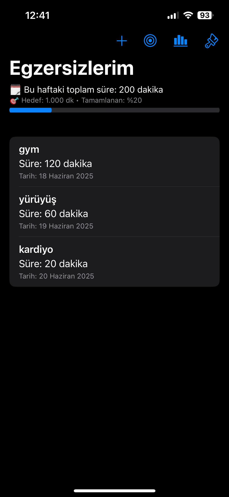
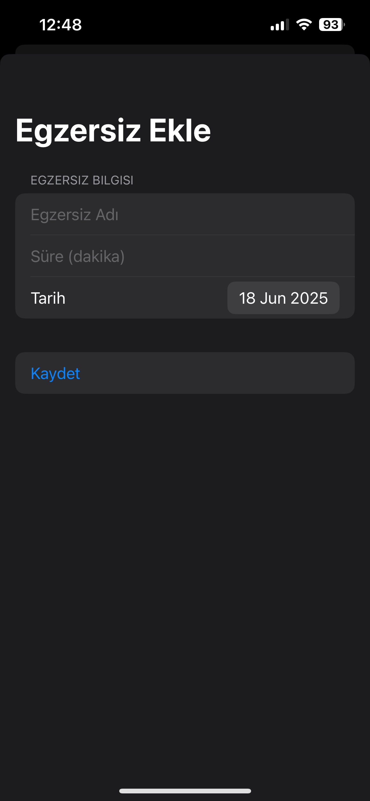
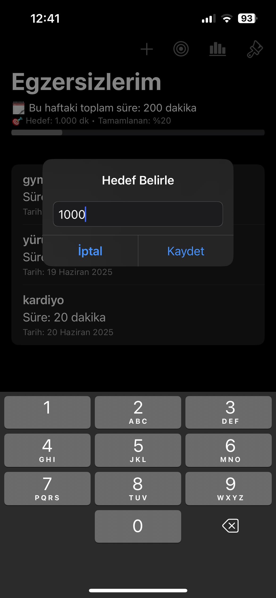
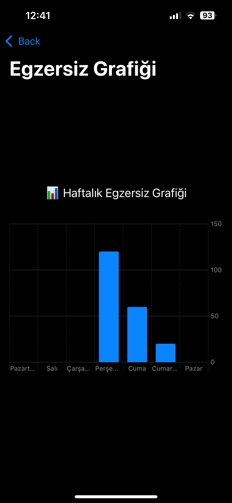
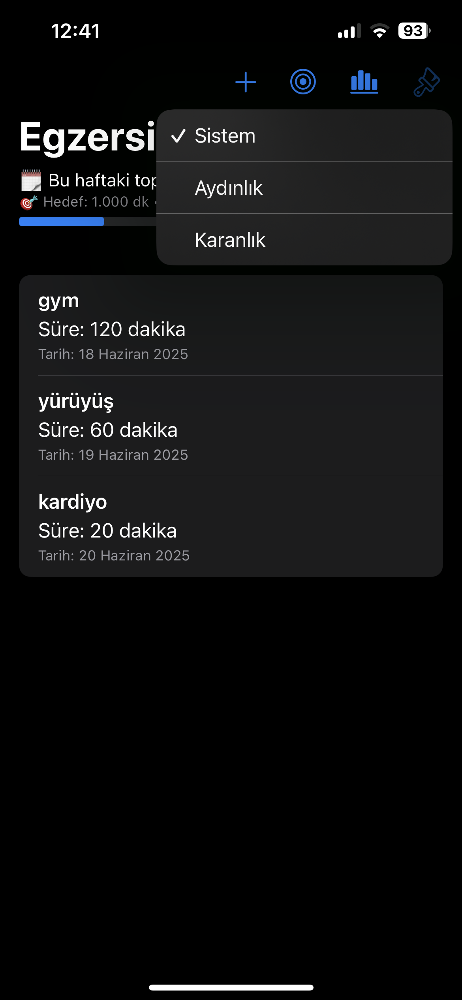
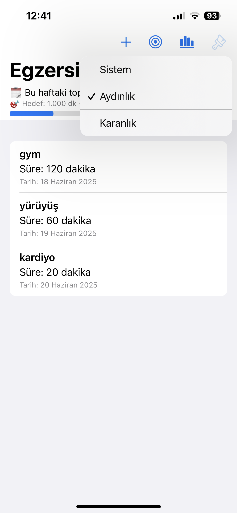

# Fitness Tracker (iOS)

Bu uygulama, kişisel egzersizlerini takip etmek isteyen kullanıcılar için geliştirilmiş sade bir iOS uygulamasıdır. Kullanıcılar egzersizlerini isim, süre ve tarih bilgisiyle kaydedebilir, haftalık toplam sürelerini görüntüleyebilir ve kendilerine hedef belirleyebilir. Uygulama ayrıca light/dark tema desteğiyle birlikte gelir.

## Özellikler

- Egzersiz ekleme (isim, süre, tarih)
- Haftalık toplam süre hesabı
- Hedef belirleme ve ilerleme çubuğu
- Hedef tamamlama yüzdesi gösterimi
- Egzersiz geçmişi listesi
- Grafiksel haftalık ilerleme ekranı (bar chart)
- Light / Dark tema seçimi

## Kullanılan Teknolojiler

- SwiftUI
- UserDefaults (veri kalıcılığı için)
- Charts Framework
- AppStorage ile tema ve ayar yönetimi

## Ekran Görüntüleri

## Geliştirici

Bu uygulama bireysel proje olarak geliştirilmiştir. Eğitim amaçlıdır ve App Store’a yüklü değildir.

